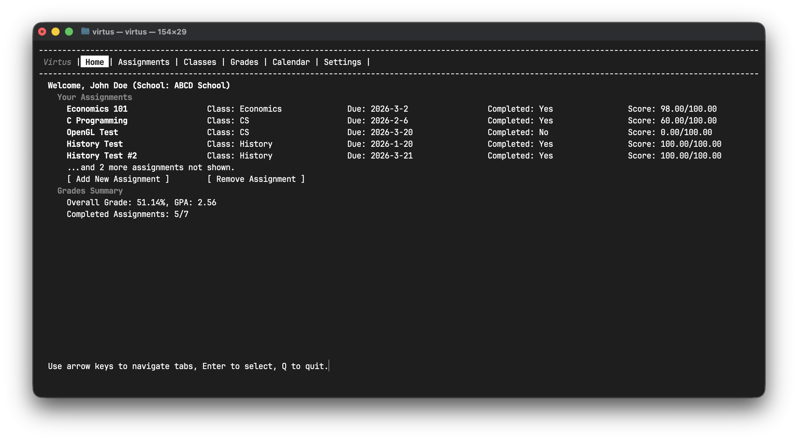
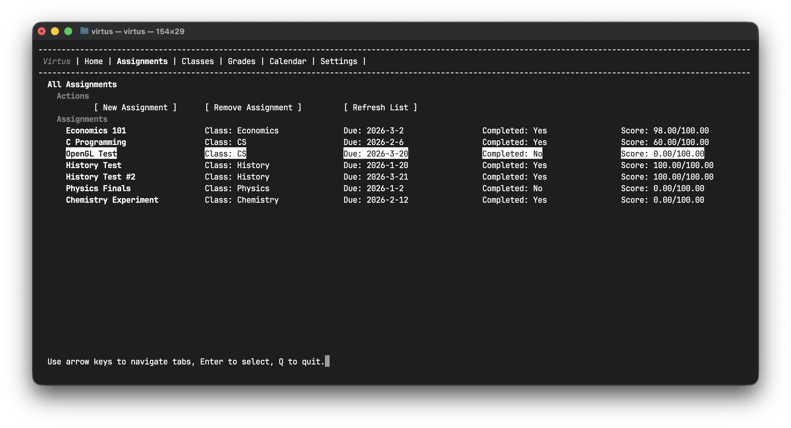
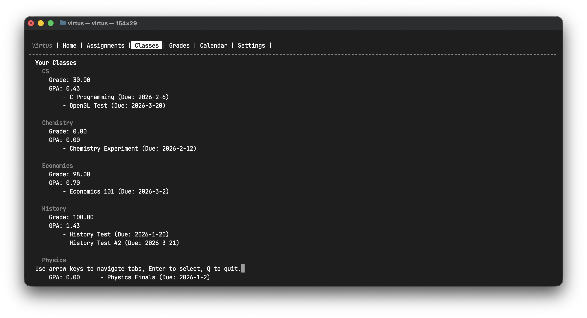
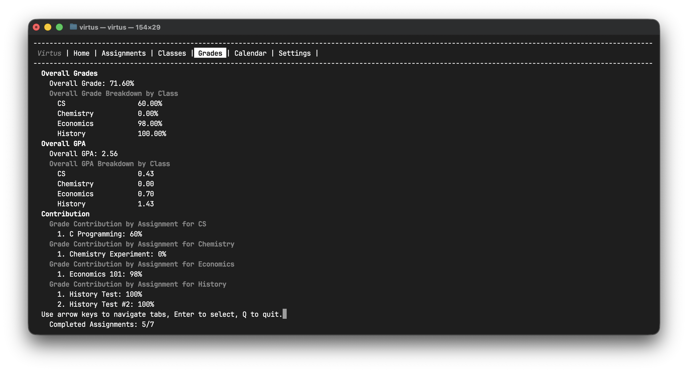
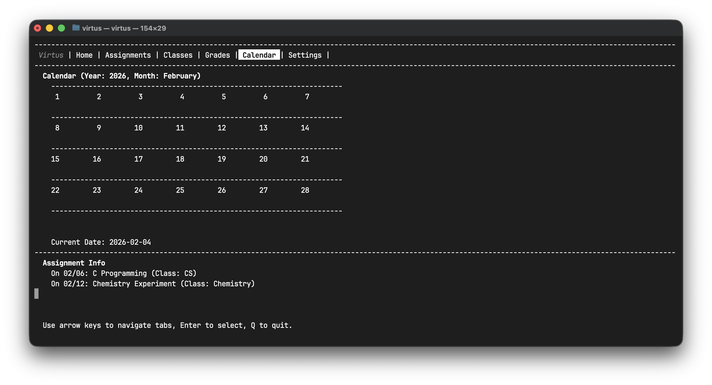

# Virtus

## Overview
Virtus is a school assignment manager and grade tracker, helping you manage your schoolwork directly from the terminal - a native habitat per se for developers.

## Features
- Manage school assignments with due dates and priorities.
- Track grades and calculate GPA.
- User-friendly interface for easy navigation.
- Student-friendly functions
- Very light to run, optimized for slow school computers (I know, it's frustrating!😡)

## Preview
### Home

**A glancable, function-oriented home interface full of data and intuitive to use.**
### Assignments

**A simple interface full of knobs and dials.**
### Classes

**Automatic class sorting and grades calculation based on the class' name. **
### Grades

**A detailed view containing a breakdown of overall/per-class GPA by class or assignment - a novel yet useful feature.**
### Finally, Calendar

**A simple calendar that lets you know of your recent assignments and their proximity to the current date.**
